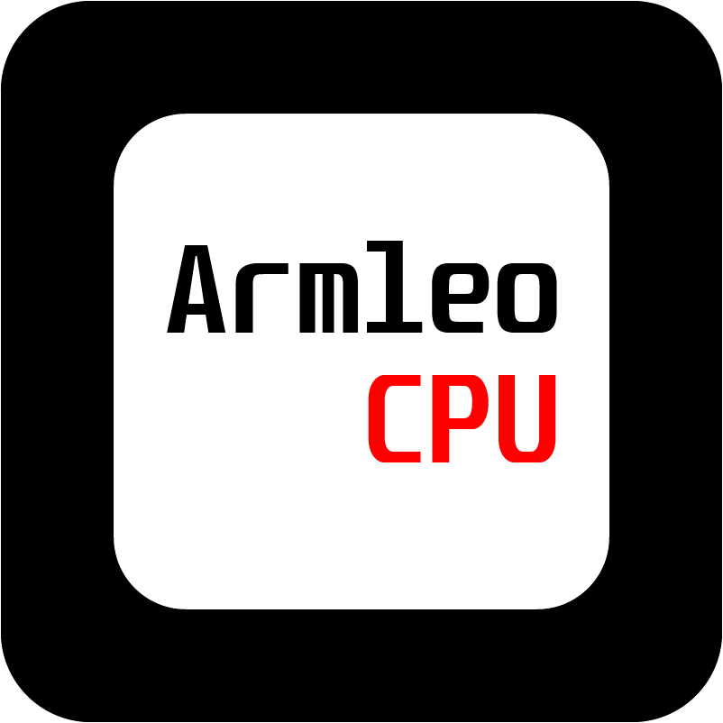

# ArmleoCPU

RISC-V RV32IMA compatible CPU created from scratch.  Work in progress to execute first instructions.

CPU includes pipeline with I-Cache and D-Cache. Cores also includes MMU making it is theoretically Linux capable with small adjustments to kernel.

Core is weak store ordered and multiple cores can be connected together for simultaneous multi processing (SMP).
Besides core, common peripherals are provided: PLIC, CLINT, AXI4 Memory, GPIO, UART, SPI, QSPI Controller for Memory mapped PSRAM, QSPI Controller for Memory mapped Flash, AXI4 Interconnect and many more.

Building minimal Linux capable system is target for this project.

See docs/docs.md for further information

This branch is partial rewrite to fix this bugs, improve perfomance and add SMP support and finally boot Linux.

ArmleoCPU logo:



# Status

Code Freeze -> No Changes planned, tested in simulation  
Work in progress -> Currently work in progress to implement and fully test  
Outdated -> Other modules changed, making this module not compatible and requires significant amount of changes  
Stalled -> Requires some other module that is currently outdated/not implemented  

Core features:
| Feature               | Status                    |
|-----------------------|---------------------------|
| ALU                   | Code Freeze               |
| BrCond                | Code Freeze               |
| CSR                   | Work in progress          |
| Decode                | Outdated, stalled         |
| Execute               | Outdated, stalled         |
| Fetch                 | Outdated, stalled         |
| JTAG_TAP              | Code Freeze               |
| JTAG_DTM              | Work in progress, stalled |
| Cache                 | Work in progress          |
| Cache/Pagefault       | Code Freeze               |
| Cache/LoadGen         | Code Freeze               |
| Cache/StoreGen        | Code Freeze               |
| Cache/PageTableWalker | Code Freeze               |
| Cache/TLB             | Code Freeze               |
| mem_1rw               | Code Freeze               |
| mem_1rwm              | Code Freeze               |
| Regfile_one_lane      | Code Freeze               |
| Regfile               | Code Freeze               |
| Divider               | Code Freeze               |
| Multiplier            | Code Freeze               |
| RegisterSlice         | Code Freeze               |
| DebugUnit             | Not implemented yet       |
| DebugUnit/CSR         | Not implemented yet       |
| Core Complex          | Not implemented yet       |
| ISA Verification      | Not implemented yet       |
| CSR Verification      | Not implemented yet       |
| Linux boot tests      | Not implemented yet       |

Peripheral features:
| Feature               | Status                        |
|-----------------------|-------------------------------|
| arbiter               | Not implemented yet           |
| axi_arbiter           | Not implemented yet, stalled  |
| axi_bram              | Code Freeze                   |
| axi_clint             | Code Freeze                   |
| axi_plic              | Not implemented yet           |
| axi_exclusive_monitor | Outdated                      |
| axi_router            | Code Freeze                   |
| axi2simple            | Code Freeze                   |
| UART8250              | Not implemented yet           |
| io_share_unit         | Not implemented yet           |
| mqspi_chip2chip       | Not implemented yet, stalled  |
| mqspi_flash_controller| Not implemented yet, stalled  |
| mqspi_psram_controller| Not implemented yet, stalled  |

# ArmleoPC
This core is used in ArmleoPC to boot Linux. See: https://github.com/armleo/ArmleoPC

# Testing
Note: Docker installation is required. User should be in docker group.

To run all available tests run:

```bash
make docker-all # Run all tests inside docker image
```

To activate docker image in interactive mode:
```bash
make interactive # Run docker in interactive mode
make # run all tests inside
```

# License
All source code for this project is under GPLv3 or later license (see COPYING file and file headers).  
If you want this project under different license contact me.

Verification tests are under BSD 3-clause license and license can be seen in tests/verif_tests folder.

