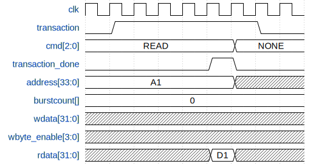
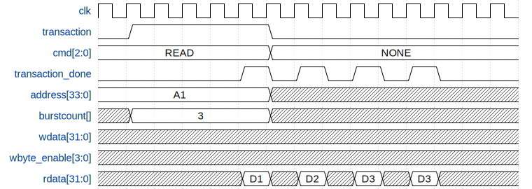
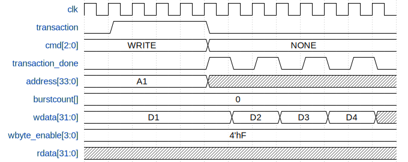

transaction  
lock
cmd[2:0]  
    0 - NONE  
    1 - READ  
    2 - WRITE  
    3 - RESERVED  
    4 - RESERVED  
    5 - RESERVED  
    6 - RESERVED  
    7 - RESERVED  
transaction_done  
transaction_response
    0 - SUCCESS  
    1 - UNKNOWN ADDRESS  
    2 - INVALID OPERATION - for example write to read only memory  
    3 to 7 - reserved
address[33:0] - byte bassed address  
burstcount[] - shows amount of bursts (reduced by one)  
wdata[31:0]  
wbyte_enable[3:0]  
rdata[31:0]  

TODO: add transaction response

When transaction response is not success then burst is canceled (for example it can do 10 words and then fail).

Examples:
  
  
  

